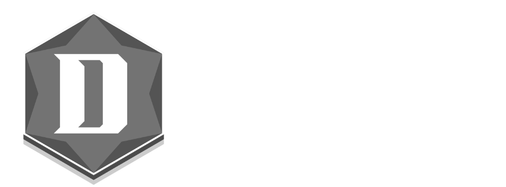

<p align="center">
  
</p>

# Decretum

An event driven low level language with 84 compiler targets. The same syntax works across all of them, but the code you write is still target specific you use each architecture's own registers, instructions, and calling conventions.

Decretum is written in Rust and includes a parser, a portable bytecode runtime with a register based virtual machine, 84 direct machine code backends, a peephole optimizer, a byte level optimizer, and a wip gui IDE.

### Examples are available in [examples](https://github.com/The-SNEK-Initiative/Decretum/edit/main/README.md).

## Creator notes
```
-----BEGIN PGP SIGNED MESSAGE-----
Hash: SHA384

This release wraps up a 1 and a half year long period of my life. During this time I spent countless hours on both
the Initiative its other projects, but I have tried to devote everything I could to Decretum whenever possible. I
really do find it a goal fulfilled for me to be able to write this, and present it to you in the form that you now
have it. The idea originally came to me when I was still learning many of the kernel architectures, and found it
extremely annoying to have to learn a new lang each time I wanted to do something. The original Decretum, the core
as one might call it, I wrote in what, around 6 days? It targeted portable/win64, vm and bios16, it was only
later, and especially recently that it exploded as much as it did thanks to the suggestions of the wonderful
people around me who gave me tons of inspiration for the project, and motivated me when I had lost the will to
continue.

Thank you to everyone for being here, and for choosing to interact with Decretum.

- -- ATroubledSnake
-----BEGIN PGP SIGNATURE-----

iJAEARYJADkWIQTVlV8jwWDsZcXVOXAHrKi6sKcGwAUCajz1GhsUgAAAAAAEAA5t
YW51MiwyLjUrMS4xMiwyLDEACgkQB6yourCnBsA6ngD+MeEOGjcRVoYf6b0laBJ3
GTKgzZT8STUdZE4piaHNhNsA+KnI0wFgTij+kWLWCSlxaR/hqrHqD0Ii3c0HcBsN
6AE=
=XAZO
-----END PGP SIGNATURE-----
```

## Targets

Everything ranging from 4 bit microprocessors to 64 qubit quantum circuits:

* **x86 (8):** bios16, uefi, x86_64, win64, win32, elf64, elf32, i8086
* **Intel evolution (3):** i4004, i8008, i8080
* **ARM (6):** armcm, arm7tdmi, arm9, aarch64, macho, cheri
* **RISC-V (3):** riscv, riscv64, riscv_cheri
* **Classic RISC (7):** mips, ppc, ppc740, ppc970, sparc, alpha, parisc
* **FPGA soft core (5):** openrisc, nios2, microblaze, mico32, picoblaze
* **Academic (3):** mmix, dlx, lc3
* **8 bit classic (5):** 6502, z80, 6809, m6800, mos6501
* **8 bit MCU (5):** pic, avr, xc800, nec78k, r8c
* **16 bit MCU (6):** msp430, c166, rl78, h8, m16c, v20
* **32 bit MCU or RISC (3):** rx, fr, v810
* **DSP (3):** tms320, blackfin, sharc
* **Hitachi, 68k, Console (4):** sh2, sh4, m68k, huc6280
* **PDP, VAX, HP (4):** pdp8, pdp11, vax, hp3000
* **Mainframe and Vintage (4):** s360, zarch, univac, cdc6600
* **VLIW (3):** vliw, elbrus, ia64
* **Military and Aerospace (2):** mil1750a, jovial (vm)
* **Soviet and Exotic (6):** ural, besm, mir, harvard, mill
* **Special (5):** vm, portable, ternary, quantum8, quantum64

## Architecture

Decretum source files use the `.dcrt` extension. The compiler parses source into a `Program` structure with events, procedures, and data declarations. Two compilation paths exist:

* **Portable bytecode** compiles to `.dcb` files executed by the built in `BytecodeRuntime` interpreter. This path supports Windows PE `.exe` output with embedded bytecode and a runtime stub.
* **Direct machine code** compiles to raw binary, bootable images, ELF, Mach-O, UEFI, or PE for any of the 84 target architectures. Each backend is a full two pass assembler with its own instruction encoding, register model, and output format.

Every backend runs a peephole optimization pass that collapses NOPs, removes dead code after branches, fills delay slots on MIPS and SPARC, eliminates SPARC save/restore window pairs, and simplifies PowerPC CR logicals. A byte level pass strips trailing filler bytes.

## CLI Usage

```
cargo run --bin decretum -- validate <file>        Validate source syntax
cargo run --bin decretum -- compile-bytecode <file> Compile to .dcb bytecode
cargo run --bin decretum -- compile-pe <file>       Compile to Windows .exe
cargo run --bin decretum -- compile-bootimg <file>  Build BIOS bootable .img
cargo run --bin decretum -- compile-uefi <file>     Build UEFI .efi
cargo run --bin decretum -- compile-arch <file>     Auto detect target and compile
cargo run --bin decretum -- compile-armcm <file>    ARM Cortex-M .bin
cargo run --bin decretum -- compile-riscv <file>    RISC-V .bin
cargo run --bin decretum -- compile-riscv64 <file>  RISC-V 64 bit .bin
cargo run --bin decretum -- compile-x86-64 <file>   x86-64 standalone .bin
cargo run --bin decretum -- compile-aarch64 <file>  AArch64 .bin
cargo run --bin decretum -- compile-vm <file>       Stack VM .vbc
cargo run --bin decretum -- compile-macho <file>    macOS Mach-O
cargo run --bin decretum -- compile-elf <file>      Linux ELF64
cargo run --bin decretum -- compile-cheri <file>    CHERI capability .bin
cargo run --bin decretum -- compile-riscv-cheri <file> RISC-V CHERI .bin
cargo run --bin decretum -- compile-win32 <file>    Windows PE32
cargo run --bin decretum -- compile-elf32 <file>    Linux ELF32
cargo run --bin decretum -- compile-project <dir>   Recursive project compile
cargo run --bin decretum -- build-native-stack <dir> Build native stack profile
```

The `compile-arch` command is the general purpose dispatcher. It reads the `target` directive from the source file and runs the correct backend automatically. For example, `target mips` compiles through the MIPS backend, `target quantum` compiles through the quantum circuit encoder, and `target bios16` compiles through the x86 real mode boot image builder.

## IDE

```
cargo run --bin ide
```

The IDE is a wip egui based code editor with:

* Syntax highlighting for all Decretum keywords, registers, builtins, strings, labels, and comments
* Multi tab editor with undo/redo stacks and autosave
* Workspace file explorer with git and build artifact exclusion
* Outline panel showing parsed symbols
* Inspector panel with program summary and build history
* Find and replace with case sensitive matching
* Command palette (Ctrl+Shift+P)
* Quick file open (Ctrl+P)
* Code snippets for portable, BIOS, RISC-V, ARM Cortex-M, 6502, loop, and procedure templates
* Inline compilation to PE, bytecode, BIOS16, RISC-V, and CHERI
* Integrated bytecode runtime execution
* Built in documentation viewer with 13 reference pages
* Diagnostics export as Markdown reports

## Hardware Boot (BIOS)

1. `cargo run --bin decretum -- compile-bootimg kernel.dcrt --out-file build/kernel.img`
2. Write `build/kernel.img` to USB with Rufus (or any other preferred pendrive img/iso "burner") in image mode
3. Boot the target machine in BIOS or CSM mode

The boot image contains a 512 byte boot sector that loads a stage2 kernel payload via CHS disk reads through INT 13h. The kernel then runs the compiled Decretum program on bare metal.

## File Extensions

* `.dcrt` source files
* `.dcb` portable bytecode
* `.qbin` quantum circuit binary
* `.vbc` stack VM bytecode
* `.img` BIOS bootable disk image
* `.efi` UEFI executable
* `.elf` Linux executable
* `.macho` macOS executable
* `.bin` raw binary for any architecture

## Development

```
cargo build --release
cargo test
```

All integration tests and unit tests must pass. Run `cargo fmt` and `cargo clippy` before submitting changes.

## Documentation

Open `docs/index.html` in any browser. The documentation includes a getting started guide, complete syntax reference, instruction model, helper functions reference, execution model documentation, target constraints, BIOS builtins reference, full backend listing with all 84 targets, PE target specifics, IDE usage guide, and example walkthroughs.

## License

See [LICENSE](LICENSE).
